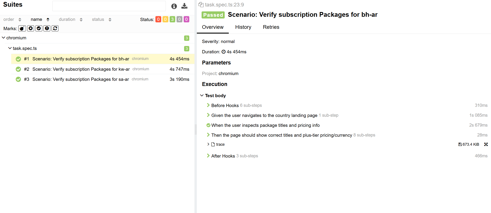
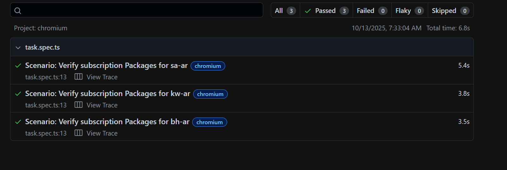
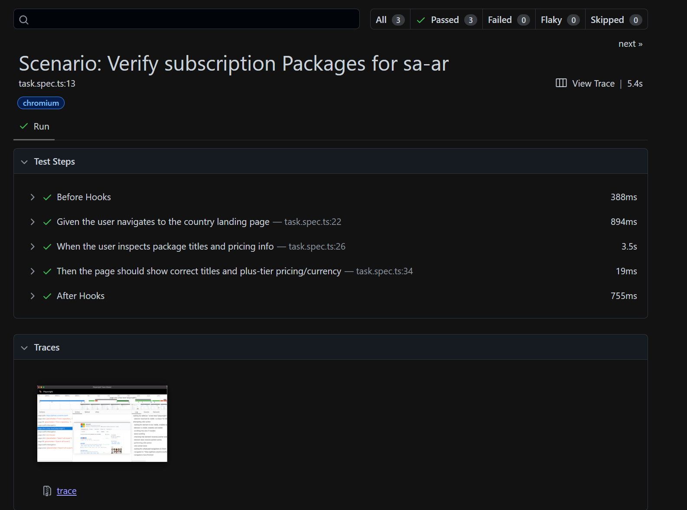

# Task 3 Subscription Packages

**Validate the Subscription Packages – Type & Price and Currency 
for all Countries (SA / Kuwait and Bahrain)**  

* **Page Object Model (POM):** Used for enhanced scalability and readability of the test code.
* **Data-Driven Testing:** Test data is stored in separate **JSON files** to prevent test repetition and improve maintainability.
* **Behavior-Driven Development (BDD) Style:** Test steps are structured using Playwright's TestSteps to produce clear, business-readable reports.

### Steps   
1. **Install dependencies**:
    ```bash
   npm install
2. **Run test**:  
   ```bash
   npx playwright test
   //for BDD files
   npx playwright test -c playwright.bdd.config.ts
3.  **View Reports:**

    * **Playwright Report:**

        ```bash
        npx playwright show-report
        ```

    * **Allure Report:**

        ```bash
        allure serve allure-results
        ```
## Results 
   Screenshots of the generated reports:

* **Allure Report** 
       
 * **PlayWright Report (Part 1)** 
    
* **PlayWright Report (Part 2)**
   

